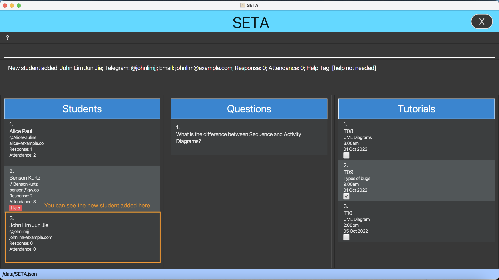
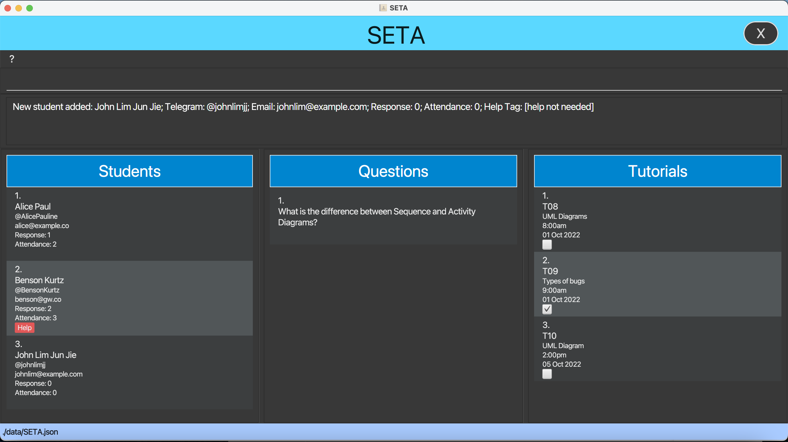
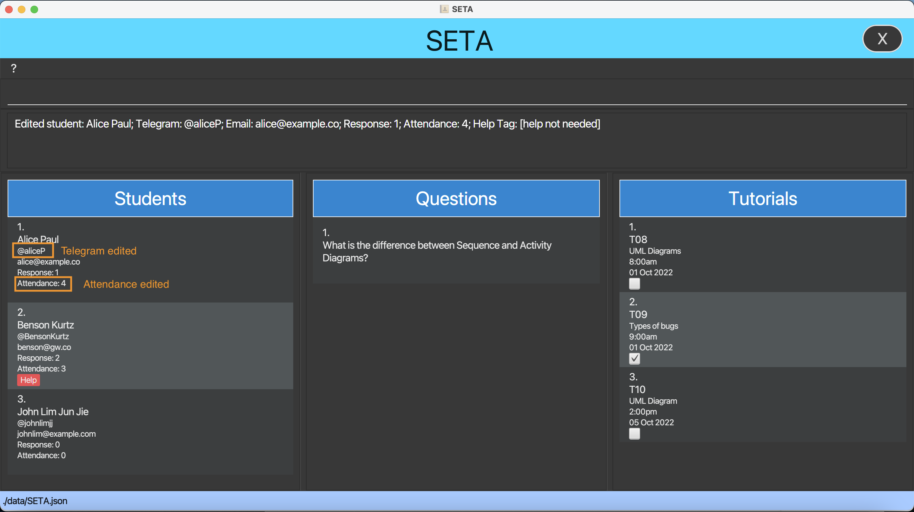
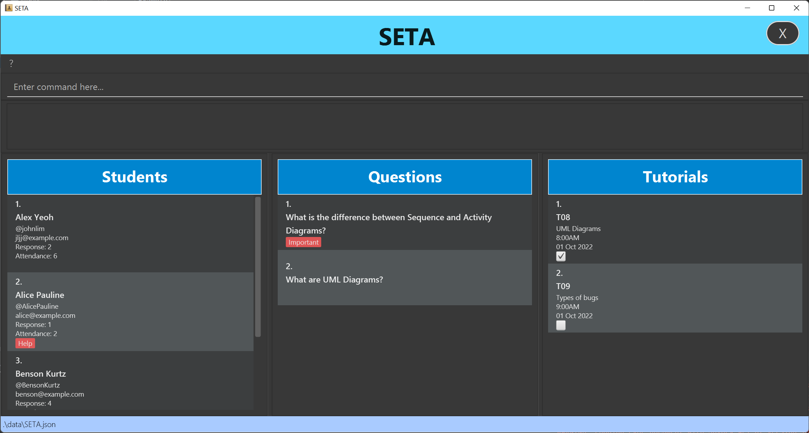
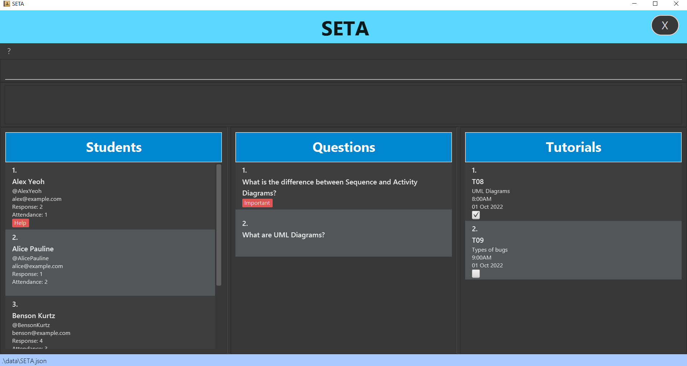
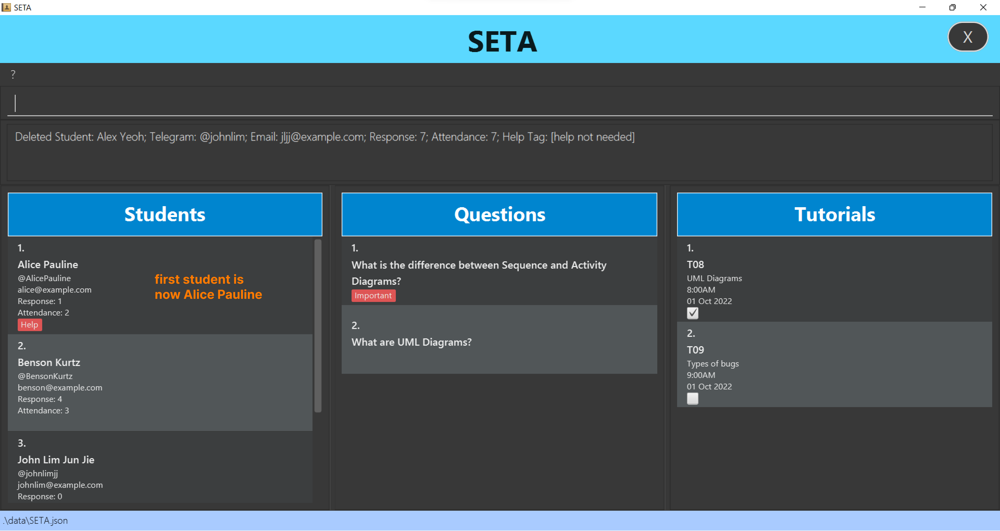
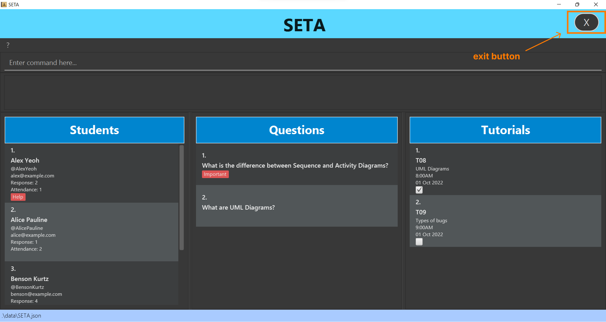

SETA (Software Engineering for Teaching Assistants) is a **desktop application for CS2103T Teaching Assistants** to 
track 
students’ and 
tutorials’ details,
and
questions asked by students. SETA is optimized for use via a [Command Line Interface (CLI)](#command-line-interface-cli) while still having the
benefits of a [Graphical User Interface (GUI)](#graphical-user-interface-gui). If you can type fast, SETA enables you to track your 
students, 
manage your
tutorials and note-down questions more effectively than traditional GUI apps.

The purpose of this guide is to inform you what features are available in SETA, and how to use them to solve your needs
as a CS2103T TA.

--------------------------------------------------------------------------------------------------------------------

## Icons

The following table will tell you the purpose of the icons used in this User Guide.

| Icon                 | Purpose                                             |
|----------------------|-----------------------------------------------------|
| :x:                  | Contains information on the constraints of commands |
| :information_source: | Additional useful explanation given                 |
| :exclamation:        | Important word of caution                           |

--------------------------------------------------------------------------------------------------------------------

## Table of Contents

* **[Quick Start](#quick-start)**
* **[Features](#features)**
    * **[Students](#students)**
        * Adding a student: [`addstu`](#adding-a-student--addstu)
        * Editing a student: [`editstu`](#editing-a-student-editstu)
        * Adding student's attendance: [`attendance`](#adding-students-attendance--attendance)
        * Adding student’s response: [`addresponse`](#adding-students-response-addresponse)
        * Adding help tag to a student: [`helpstu`](#adding-help-tag-helpstu)
        * Deleting a student: [`deletestu`](#deleting-a-student-deletestu)
        * Finding a student: [`findstu`](#finding-a-student-findstu)
        * Listing all students: [`liststu`](#listing-all-students-liststu)
    * **[Questions](#questions)**
        * Adding a question: [`addq`](#adding-a-question--addq)
        * Marking a question as important: [`markq`](#marking-a-question-as-important--markq)
        * Marking a question as unimportant: [`unmarkq`](#marking-a-question-as-unimportant--unmarkq)
        * Deleting a question: [`deleteq`](#deleting-a-question--deleteq)
    * **[Tutorials](#tutorials)**
        * Adding a tutorial: [`addtut`](#adding-a-tutorial--addtut)
        * Deleting a tutorial: [`deletetut`](#deleting-a-tutorial--deletetut)
        * Marking a tutorial: [`marktut`](#marking-a-tutorial-marktut)
        * Marking a tutorial as undone: [`unmarktut`](#marking-a-tutorial-as-undone-unmarktut)
    * **Clearing SETA**: [`clear`](#clearing-data-in-seta--clear)
    * **Exiting the program**: [`exit`](#exiting-seta--exit)
* **[FAQ](#faq)**
* **[Command Summary](#command-summary)**
* **[Glossary](#glossary)**

--------------------------------------------------------------------------------------------------------------------

## Quick Start

1. Ensure you have [Java 11](https://www.oracle.com/sg/java/technologies/javase/jdk11-archive-downloads.html) or above
   installed on your Computer. If you have issues doing so, refer to the troubleshooting
   guide [here](https://docs.oracle.com/en/java/javase/11/install/installation-jdk-microsoft-windows-platforms.html#GUID-0DB9580B-1ACA-4C13-8A83-9780BEDF30BB)
   .

2. Download the latest `SETA.jar` from [here](https://github.com/AY2223S1-CS2103T-T08-4/tp/releases).

3. Copy the file to the folder you want to use as the _home folder_ for your SETA.

4. Double-click the file to start the app. The GUI similar to the one below should appear in a few seconds. Note how the
   app contains some sample data.
     
   
     
5. Type the command in the command box and press Enter to execute it. e.g. typing **`liststu`** and pressing Enter will
   list all the students in the 'Student' column. 

Some example commands you can try:

* **`addstu`**`n/John Lim Jun Jie h/@johnlimjj e/johnlim@example.com`: Adds a student named `John Lim Jun Jie` to the
  student list.

* **`deletestu`**`3`: Deletes the 3rd student shown in the current list.

* **`exit`**: Exits the app.

You can refer to the [Features](#features) below for details of each command.

--------------------------------------------------------------------------------------------------------------------

## Features

SETA contains features that allow you to manage 3 things:

1. [Students](#students)
2. [Questions](#questions)
3. [Tutorials](#tutorials)

**:information_source: Notes about the command format:** 

* Words in `UPPER_CASE` are the parameters to be supplied by you. 
  e.g. in `addstu n/NAME`, `NAME` is a parameter that can be used as `addstu n/John Lim`.

* Items in square brackets are optional. 
  e.g. `n/NAME [h/TELEGRAM_HANDLE]` can be used as `n/John Lim h/@johnlim` or as `n/John Lim`.

* Parameters can be in any order. 
  e.g. if the command specifies `n/NAME e/EMAIL`, `e/EMAIL n/NAME` is also acceptable.

* If a parameter is expected only once in the command, but you specified it multiple times, only the last occurrence of
  the parameter will be taken. 
  e.g. if you specify `h/@johnlim h/@johnlimjj`, only `h/@johnlimjj` will be taken.

* Extraneous parameters for commands that do not take in parameters (such as `liststu` and `exit`) will be ignored. 
  e.g. if the command specifies `liststu 123`, it will be interpreted as `liststu`.

* `INDEX`, a commonly used parameter in our commands, must be a positive non-zero integer e.g. 1, 2, 3,... and less than
  the number of items in its respective list e.g. for `markq`, `INDEX` must be less than the number of questions in the question
  list.

* `INDEX` refers to the index number shown in the respective displayed list.

### Students

The features under the student category allow you to keep track of and manage the students under you. You can see your
student's details, such as their names, telegram handles, and email. The latter two aid you in contacting any students
if necessary. You can also track each student's attendance and responses (the number of messages he or she has sent on
Zoom) to record their participation.

### Adding a student : `addstu`

This feature allows you to add a student to SETA. To add a student, you must include their name, telegram handle and
email.

**Format**: `addstu n/NAME h/TELEGRAM_HANDLE e/EMAIL`

**:x: Command Constraints** 

* Name constraints
    * Name should only contain alphanumeric characters and spaces, and it should not be blank.

* Telegram handle constraints
    * Telegram handle must start with a '@', followed by an alphanumeric character.
    * After the first character, the telegram handle can only contain alphanumeric characters or underscores.

* Email constraints
    * Email can only contain alphanumeric characters.
    * Email must end with a top-level domain (E.g. `.com`, `.u.nus.edu`)

**Example**:

* `addstu n/John Lim Jun Jie h/@johnlimjj e/johnlim@example.com`

### Editing a student: `editstu`

This feature allows you to edit an existing student in the student list. Editing a student enables you to amend any
mistake or changes made to the student's details.

**Format**: `editstu INDEX [n/NAME] [h/TELEGRAM_HANDLE] [e/EMAIL] [a/ATTENDANCE]`

* The student at the specified `INDEX` will be edited. (E.g. If you input '3' as the `INDEX`, student 3 will be edited)
* At least one of the fields (E.g. [n/NAME] or [e/EMAIL]) must be provided.
* Existing fields will be updated to the input values.
* Editing a student with the same details as the student's original details will be accepted.
  (E.g. executing `editstu 1 h/@test` when student 1's telegram handle is already `@test`, will still be accepted as an
  edit.)

**:x: Command Constraints** 

* Name constraints
    * Name should only contain alphanumeric characters and spaces, and it should not be blank.
* Telegram handle constraints
    * Telegram handle must start with a '@', followed by an alphanumeric character.
    * After the first character, the telegram handle can only contain alphanumeric characters or underscores.
* Email constraints
    * Email can only contain alphanumeric characters.
    * Email must end with a top-level domain (E.g. `.com`, `.u.nus.edu`)
* Attendance constraints
    * Attendance number should be a positive integer (E.g. 1, 2,...)
    * Input attendance value without any extra '0's before and after the intended attendance value. (E.g. '0' instead
      of '0000' and '3' instead of '003').

**Examples**:

* `editstu 1 h/@aliceP a/4` Edits the telegram handle and attendance of the 1st student to @aliceP and 4
  respectively.  
    * Before
        
      \
       
    * After
        
      

### Adding student's attendance : `attendance`

This feature allows you to take attendance of your students after each tutorial. It helps you to increment a student's
attendance by 1. At the end of the semester, you can have an overview of all the students' attendance for grading
purposes (participation marks).

Format: `attendance INDEX`

Example:

* `attendance 1`
    
    * Before
        
      
        
    * After
        
      

### Adding student's response: `addresponse`

This feature allows you to edit your students' response count. This helps you to track your student's participation in
the tutorial through the recording number of messages sent by him/her.

Format: `addresponse INDEX m/MESSAGE_COUNT`

* Edits response count of the student at the specified `INDEX`.
    * If `addresponse 1 m/7` is keyed in after `addresponse 1 m/2`, the response count for the first student in the
      student list will be 7 instead of 2.
* If `m\0000000000` is given as an input, 0s will not be truncated and response will be displayed as
  `response: 000000000`

**:x: Command Constraints** 

* The `MESSAGE_COUNT` must be a positive integer 1, 2, 3, ...

Example:

* `addresponse 1 m/7`
    
    * Before
        
      
        
    * After
        
      

### Adding help tag: `helpstu`

This feature allows you to add a help tag to an existing student. When you notice that a specific student has not been
attending tutorials or needs help in general, you can enter this command to indicate that the student needs help. You
will then have a rough idea who needs more of your attention during tutorials.

Format: `helpstu INDEX`

Example:

* `helpstu 1`

### Removing help tag: `unhelpstu`

This feature allows you to remove help tag from an existing student. You can enter this command when you find a specific
student that you thought needed help is doing well or does not need special attention anymore.

Format: `unhelpstu INDEX`

Example:

* `unhelpstu 1`

### Deleting a student: `deletestu`

This feature allows you to remove a specific student. If a student has left the module or swapped tutorial group, you
can delete him from the list.

Format: `deletestu INDEX`

Example:

* `deletestu 2`
    
* Before
    
  
    
* After
    
  

### Finding a student: `findstu`

This feature allows you to find one or more specific students whose names contain any of the given keywords to view
their details. After using this feature, you can use the `liststu` command to go back to view all your students.

Format: `findstu KEYWORD [MORE_KEYWORDS]`

* Finds student(s) with specified KEYWORD [MORE_KEYWORDS] in their name(s).
* The keyword is case-insensitive.

Examples:

* `findstu bob`
* `findstu john mary`

### Listing all students: `liststu`

This feature allows you to list all students you have. This feature is useful after using the `findstu` feature to view
all the students that you have.

Format: `liststu`

Example:

* `liststu`

### Questions

The features under the question category allows you to keep track of questions asked by students. These questions are
added when you do not have enough time to answer them. Furthermore, if you find a question that requires urgent
clarification or critical thinking, you can indicate these questions as important on the display.

### Adding a question : `addq`

This feature allows you to add a question to the question list, allowing you to keep track of the questions you have to
address.

Format: `addq QUESTION_DESCRIPTION`

Example:

* `addq what is the difference between self-invocation and call-backs for sequence diagrams?`

### Marking a question as important : `markq`

This feature allows you to indicate on the display that this question is important and requires more attention compared
to the other questions.

Format: `markq INDEX`

* Marks the question at the specified `INDEX` as important.

Example:

* `markq 1` marks the first question in the question list as important
    

  

### Marking a question as unimportant : `unmarkq`

This feature allows you to indicate on the display that this question is unimportant. It is used when if the question
was marked as important by mistake.

Format: `unmarkq INDEX`

* Marks the question at the specified `INDEX` as unimportant.

Example:

* `unmarkq 1` marks the first question in the question list as unimportant

### Deleting a question : `deleteq`

This feature allows you to delete a question in the question list. Once a question has been addressed, you can delete it
from the list.

Format: `deleteq INDEX`

Example:

* `deleteq 1` deletes the first question from the question list

### Tutorials

The features under the tutorial category allow you to keep track of and manage your tutorials and consultations. You can
see the group number, content, date and time for your tutorials. These correspond to the `GROUP_NUMBER`,
`CONTENT` and `DATE TIME` parameters accordingly. You can also mark each tutorial as done or undone.

### Adding a tutorial : `addtut`

Adds a tutorial to the tutorial list.

Format: `addtut [g/GROUP_NUMBER] [c/CONTENT] [t/DATE TIME]`

* The format of the date must be in the YYYY-MM-DD.
* The format of the time must be in 24h format HHmm.

Example:

* `addtut g/T08 c/UML diagrams t/2022-10-01 1400`
    

  

### Deleting a tutorial : `deletetut`

Deletes a tutorial in the tutorial list.

Format: `deletetut INDEX`

* Deletes the tutorial at the specified `INDEX`.

Example:

* `deletetut 1`deletes the first tutorial from the tutorial list

 

### Marking a tutorial: `marktut`

This feature allows you to mark a tutorial as complete.

Format: `marktut INDEX`

* Marks the tutorial at the specified `INDEX`.

Example:

* `marktut 1` marks the first tutorial from the tutorial list as done.

### Marking a tutorial as undone: `unmarktut`

This feature allows you to unmark the tutorial as complete. If a tutorial was mistakenly marked as done, you can undo it
using this feature.

Format: `unmarktut INDEX`

* Unmark the tutorial at the specified `INDEX`.

Example:

* `unmarktut 1` marks the first tutorial from the tutorial list as undone.

### Clearing data in SETA : `clear`

This feature allows you to clear all the data in SETA. You can use this to clear the sample data given at the beginning
or when you want to delete all your data at once.

Format: `clear `

### Exiting SETA : `exit`

This feature allows you to exit SETA.

Format: `exit`

### Saving the data

SETA data are saved in the [hard disk](#hard-disk) automatically after any command that changes the data. There is no
need to save manually.

### Editing the data file

SETA data are saved as a [JSON file](#json-file) `[JAR file location]/data/seta.json`. Advanced users are welcome to
update data directly by editing that data file.

:exclamation: **Caution:**
If your changes to the data file makes its format invalid, SETA will discard all data and start with an empty data file at the next run.

--------------------------------------------------------------------------------------------------------------------

## FAQ

You can find answers to frequently asked questions here.

<h3><strong>General</strong></h3>

<strong>Q: How do I transfer my data to another Computer?</strong> 
<strong>A</strong>: Install the app on the other computer and overwrite the empty data file it creates with the file
that contains the data of your previous SETA home folder.

    

<strong>Q: I cannot see the sample data, what do I do?</strong> 
<strong>A</strong>: Delete all the files under `[JAR file location]/data` and restart the jar application. You should be
able to see the sample data now.

    

<strong>Q: What does the cross button at the top right-hand of the application do?</strong> 
<strong>A</strong>: You can simply click on that button to exit the application!

    

<strong>Q: What is the difference between using the `exit` command and the cross button at the top right hand of the
application?</strong> 
<strong>A</strong>: Both does the same job! The cross button is for your convenience if you feel typing `exit` is too
troublesome!

    

<strong>Q: What does the question mark at the top left-hand of the application do?</strong>
<strong>A</strong>: You can simply click on that button to view the link to our User Guide if you face any issues when
using our application!

<h3><strong>Students</strong></h3>

<strong>Q: How do I edit the attendance for my student?</strong> 
<strong>A</strong>: There are 2 ways you can edit the attendance of your students!

* Using the `editstu` feature. The `editstu` feature allows you to edit the attendance by any number.   
  (E.g. `editstu 3 a/5` changes the attendance of student 3 to 5.)
* Using the `attendance` feature. The `attendance` feature allows you to increase the attendance by 1.   
  (E.g. `attendance 2` increases attendance of student 2 by 1.)

<h3><strong>Questions</strong></h3>

<strong>Q: Is there a way to delete all the questions using one command?</strong> 
<strong>A</strong>: Unfortunately, this feature will be rolled out in a future version of the app. Stay tuned!

<h3><strong>Tutorials</strong></h3>

<strong>Q: Can I type the date and time in a different format?</strong> 
<strong>A</strong>: Unfortunately, the current version of SETA only accepts the date and time format
of `YYYY-MM-DD HHmm`. However, there will be improvements made in the near future so that SETA can take in other date
and time formats to better serve you. Please look forward to it!

--------------------------------------------------------------------------------------------------------------------

## Command Summary

This command summary gives you an overview of all the commands available in SETA for your easy reference.

| Action         | Format, Examples                           |
|----------------|--------------------------------------------|
| **Add**        | `addstu`, `addq`, `addtut`                 |
| **Attendance** | `attendance`, `addresponse`                |
| **Delete**     | `deletestu`, `deleteq`, `deletetut`        |
| **Edit**       | `editstu`                                  |
| **Find**       | `findstu`                                  |
| **List**       | `liststu`                                  |
| **Mark**       | `markq`, `unmarkq`, `marktut`, `unmarktut` |
| **Tag**        | `helpstu`, `unhelpstu`                     |
| **Clear**      | `clear`                                    |
| **Exit**       | `exit`                                     |

--------------------------------------------------------------------------------------------------------------------

## Glossary

This glossary provides the definitions of certain terms used in this user guide.

### Command Line Interface (CLI)

CLI is a program that allows you to create, modify and delete files using a text-based display. In SETA, all you have
to do is to type in the command box (red rectangle in the image below) and press enter to track your students and manage
your questions and tutorials.

### Graphical User Interface (GUI)

GUI is a kind of display that allows you to perform an action within the application through the graphics in the app. 
For example, clicking on the exit button (top right cross icon) in SETA allows you to exit SETA.

### JSON file

A [JSON](https://en.wikipedia.org/wiki/JSON) (JavaScript Object Notation) file is a file with an open standard file format and a data interchange format. 
Its purpose is to use human-readable text to store and transmit data objects. Such a file is used in SETA to store 
information for the student, question and tutorial list.

### Hard Disk

A [hard disk](https://en.wikipedia.org/wiki/Hard_disk_drive) (or hard disk drive) is a data storage device that 
stores and retrieves digital data. This is found in your device that is running SETA.

